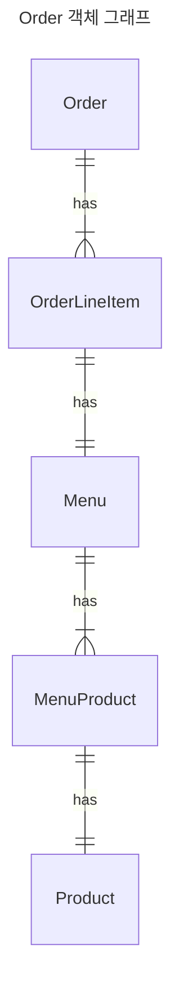
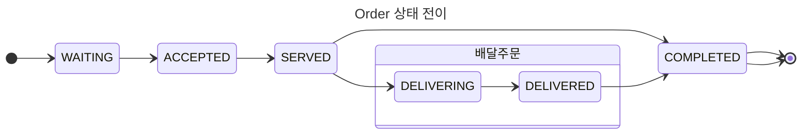

# 키친포스

## 퀵 스타트

```sh
cd docker
docker compose -p kitchenpos up -d
```

## 요구 사항

### 상품

- 상품을 등록할 수 있다.
- 상품의 가격이 올바르지 않으면 등록할 수 없다.
    - 상품의 가격은 0원 이상이어야 한다.
- 상품의 이름이 올바르지 않으면 등록할 수 없다.
    - 상품의 이름에는 비속어가 포함될 수 없다.
- 상품의 가격을 변경할 수 있다.
- 상품의 가격이 올바르지 않으면 변경할 수 없다.
    - 상품의 가격은 0원 이상이어야 한다.
- 상품의 가격이 변경될 때 메뉴의 가격이 메뉴에 속한 상품 금액의 합보다 크면 메뉴가 숨겨진다.
- 상품의 목록을 조회할 수 있다.

### 메뉴 그룹

- 메뉴 그룹을 등록할 수 있다.
- 메뉴 그룹의 이름이 올바르지 않으면 등록할 수 없다.
    - 메뉴 그룹의 이름은 비워 둘 수 없다.
- 메뉴 그룹의 목록을 조회할 수 있다.

### 메뉴

- 1 개 이상의 등록된 상품으로 메뉴를 등록할 수 있다.
- 상품이 없으면 등록할 수 없다.
- 메뉴에 속한 상품의 수량은 0 이상이어야 한다.
- 메뉴의 가격이 올바르지 않으면 등록할 수 없다.
    - 메뉴의 가격은 0원 이상이어야 한다.
- 메뉴에 속한 상품 금액의 합은 메뉴의 가격보다 크거나 같아야 한다.
- 메뉴는 특정 메뉴 그룹에 속해야 한다.
- 메뉴의 이름이 올바르지 않으면 등록할 수 없다.
    - 메뉴의 이름에는 비속어가 포함될 수 없다.
- 메뉴의 가격을 변경할 수 있다.
- 메뉴의 가격이 올바르지 않으면 변경할 수 없다.
    - 메뉴의 가격은 0원 이상이어야 한다.
- 메뉴에 속한 상품 금액의 합은 메뉴의 가격보다 크거나 같아야 한다.
- 메뉴를 노출할 수 있다.
- 메뉴의 가격이 메뉴에 속한 상품 금액의 합보다 높을 경우 메뉴를 노출할 수 없다.
- 메뉴를 숨길 수 있다.
- 메뉴의 목록을 조회할 수 있다.

### 주문 테이블

- 주문 테이블을 등록할 수 있다.
- 주문 테이블의 이름이 올바르지 않으면 등록할 수 없다.
    - 주문 테이블의 이름은 비워 둘 수 없다.
- 빈 테이블을 해지할 수 있다.
- 빈 테이블로 설정할 수 있다.
- 완료되지 않은 주문이 있는 주문 테이블은 빈 테이블로 설정할 수 없다.
- 방문한 손님 수를 변경할 수 있다.
- 방문한 손님 수가 올바르지 않으면 변경할 수 없다.
    - 방문한 손님 수는 0 이상이어야 한다.
- 빈 테이블은 방문한 손님 수를 변경할 수 없다.
- 주문 테이블의 목록을 조회할 수 있다.

### 주문

- 1개 이상의 등록된 메뉴로 배달 주문을 등록할 수 있다.
- 1개 이상의 등록된 메뉴로 포장 주문을 등록할 수 있다.
- 1개 이상의 등록된 메뉴로 매장 주문을 등록할 수 있다.
- 주문 유형이 올바르지 않으면 등록할 수 없다.
- 메뉴가 없으면 등록할 수 없다.
- 매장 주문은 주문 항목의 수량이 0 미만일 수 있다.
- 매장 주문을 제외한 주문의 경우 주문 항목의 수량은 0 이상이어야 한다.
- 배달 주소가 올바르지 않으면 배달 주문을 등록할 수 없다.
    - 배달 주소는 비워 둘 수 없다.
- 빈 테이블에는 매장 주문을 등록할 수 없다.
- 숨겨진 메뉴는 주문할 수 없다.
- 주문한 메뉴의 가격은 실제 메뉴 가격과 일치해야 한다.
- 주문을 접수한다.
- 접수 대기 중인 주문만 접수할 수 있다.
- 배달 주문을 접수되면 배달 대행사를 호출한다.
- 주문을 서빙한다.
- 접수된 주문만 서빙할 수 있다.
- 주문을 배달한다.
- 배달 주문만 배달할 수 있다.
- 서빙된 주문만 배달할 수 있다.
- 주문을 배달 완료한다.
- 배달 중인 주문만 배달 완료할 수 있다.
- 주문을 완료한다.
- 배달 주문의 경우 배달 완료된 주문만 완료할 수 있다.
- 포장 및 매장 주문의 경우 서빙된 주문만 완료할 수 있다.
- 주문 테이블의 모든 매장 주문이 완료되면 빈 테이블로 설정한다.
- 완료되지 않은 매장 주문이 있는 주문 테이블은 빈 테이블로 설정하지 않는다.
- 주문 목록을 조회할 수 있다.

## 용어 사전

### 기타

| 한글명 | 영문명        | 설명                             |
|-----|------------|--------------------------------|
| 점주  | owner      | 상품을 파는 사람이다                    |
| 고객  | consumer   | 상품을 사는 사람이다                    |
| 매장  | store      | 키친 포스기가 설치되었으며, 상품을 사고 파는 매장이다 |
| 비속어 | purgomalum | 상품, 메뉴, 테이블의 이름으로 사용될 수 없는 단어다 |

### 상품

| 한글명      | 영문명          | 설명                           |
|----------|--------------|------------------------------|  
| 상품       | product      | 상품은 고객이 구매하는 음식이다            |
| 상품 가격    | price        | 상품 가격은 고객이 구매하는 음식의 가격이다     |
| 상품 이름    | product name | 상품 이름은 고객이 구매하는 음식 이름이다      |
| 상품 가격 변경 | change       | 상품 가격의 수정, 변경 등을 포괄한다        |
| 상품 목록    | product list | 상품의 목록이다                     |
| 상품 등록    | register     | 새로운 상품의 등록, 추가, 생성을 포괄하는 단어다 |

### 메뉴 그룹

| 한글명      | 영문명             | 설명                |
|----------|-----------------|-------------------|  
| 메뉴 그룹    | menu group      | 메뉴들의 분류를 의미한다     |
| 메뉴 그룹 이름 | menu group name | 메뉴들의 분류를 정의한 이름이다 |
| 메뉴 그룹 목록 | menu group list | 메뉴 그룹의 목록이다       |

### 메뉴

| 한글명      | 영문명          | 설명                                                                                              |
|----------|--------------|-------------------------------------------------------------------------------------------------|
| 메뉴       | menu         | 1개 이상의 메뉴상품들로 구성한 메뉴다                                                                           |
| 메뉴 이름    | menu name    | 메뉴를 칭하는 이름                                                                                      |
| 메뉴 가격    | price        | 메뉴 상품 가격의 총 합이다                                                                                 |
| 노출       | display      | 메뉴를 고객에게 보여준다                                                                                   |
| 비노출      | hide         | 메뉴를 고객에게 보여주지 않는다 </br> - 비노출은 점주가 설정할 수 있다. </br> - 점주가 상품의 가격을 변경할 때 메뉴 상품의 합보다 크면 비노출로 변경된다. |
| 메뉴 목록    | menu list    | 메뉴들의 목록이다                                                                                       |
| 메뉴 상품    | menu product | 메뉴에 속한 상품이다                                                                                     |
| 메뉴 상품 수량 | quantity     | 메뉴에 속한 상품의 수량이다                                                                                 |

### 주문 테이블

| 한글명        | 영문명                     | 설명                          |
|------------|-------------------------|-----------------------------|
| 주문 테이블     | order table             | 고객가 매장주문을 할 수 있는 테이블이다      |
| 이름         | order table name        | 주문 테이블의 이름이다                |
| 빈 테이블      | empty table             | 테이블이 비어있어 주문을 받을 수 있는 테이블   |
| 손님이 있는 테이블 | occupied table          | 주문이 발생된 테이블                 |
| 고객 수       | buyer quantity          | 주문 테이블에 있는 고객 수             |
| 주문 테이블 목록  | order table list        | 주문 테이블의 목록이다                |
| 치운다        | clear                   | 주문 테이블을 고객를 받을 수 있는 상태로 만든다 |
| 채운다        | seat                    | 빈 주문 테이블에 고객를 받는다           |
| 고객 수를 변경   | change number of guests | 주문 테이블에 채워진 고객 수를 변경한다      |

### 주문

| 한글명      | 영문명             | 설명                                                                                              |
|----------|-----------------|-------------------------------------------------------------------------------------------------|
| 주문       | order           | 고객이 구매를 요청한 메뉴들의 묶음이다                                                                           |
| 주문 유형    | order type      | 주문의 유형으로 배달, 포장, 매장 주문이 있다                                                                      |
| 주문 항목    | order line item | 고객이 구매를 요청한 메뉴다                                                                                 |
| 주문 항목 수량 | quantity        | 고객이 구매를 요청한 주문 항목의 수량이다. </br> - 매장 주문은 주문 항목 수량 0 미만일 수 있다 </br> 배달,포장 주문은 주문 항목 수량이 0 초과여야 한다 |
| 주문 접수 대기 | WAITING         | 점주가 주문을 수락하기 전 상태                                                                               |
| 주문 접수    | ACCEPTED        | 점주가 주문을 수락한 상태                                                                                  |
| 주문 제공    | SERVED          | 점주가 고객에게 주문된 메뉴상품을 제공한다                                                                         |
| 주문 완료    | COMPLETED       | - 포장과 매장은 주문 제공 이후의 상태<br/> - 배달은 배달이 완료된 이후의 상태                                                |
| 주문 목록    | order list      | 주문들의 목록이다                                                                                       |

### 배달 주문

| 한글명    | 영문명              | 설명                                 |
|--------|------------------|------------------------------------|
| 배달 주문  | delivery order   | 고객이 메뉴 상품을 배달로 받기를 원하는 주문이다        |
| 배달 주소  | delivery address | 고객이 주문한 메뉴 상품을 배달로 수령할 장소이며 필수값이다. |
| 배달 대행사 | delivery agency  | 배달 위탁 업체                           |
| 라이더    | rider            | 배달을 수행하는 사람                        |
| 배달 중   | DELIVERING       | 배달이 진행중인 상태                        |
| 배달 완료  | DELIVERED        | 배달이 완료된 상태                         |
| 배달 요청  | request delivery | 배달 대행사에 배달을 요청한다                   |

### 포장 주문

| 한글명   | 영문명         | 설명                                           |
|-------|-------------|----------------------------------------------|
| 포장 주문 | TO GO order | 고객의 주문이 수락되고 주문한 메뉴상품이 제공될 때 포장으로 수령하는 주문이다. |

### 매장 주문

| 한글명   | 영문명          | 설명                                         |
|-------|--------------|--------------------------------------------|
| 매장 주문 | EAT IN order | 고객의 주문이 수락되고 주문한 메뉴상품이 제공될 때 배달로 수령하는 주문이다 |

## 모델링

## 상품
- `Product`는 `quantity`을 가진다
- `Product`는 `price`을 가진다
- `Product`는 `name`을 가진다
  
- 행위
  - `Product`를 `등록`할 수 있다
    - `Product`의 `name`은 `비속어`가 포함될 수 없다
  - `Product`의 `price`를 `변경`할 수 있다
    - `Product`의 `price`는 0원 이상이어야 한다
  - `Product`의 `price`가 변경될 때 `Menu`의 `price`보다 크면 `Menu`가 `비노출`이 된다

## 메뉴 그룹
- `MenuGroup`은 `name`을 가진다
- 행위
  - `MenuGroup`을 `등록`할 수 있다
    - `MenuGroup`의 `name`은 `비워 둘 수 없다`
  - `MenuGroup`의 `목록`을 `조회`할 수 있다

## 메뉴
- `Menu`는 `name`을 가진다
- `Menu`는 `price`를 가진다
- `Menu`는 `display`를 가진다
- `Menu`는 메뉴에 속한 상품을 표현하는 `MenuProduct`를 가진다
- 메뉴 행위
  - `Menu`를 `등록`할 수 있다
    - `Menu`의 `name`은 `비속어`가 포함될 수 없다
    - `Menu`의 `price`는 0원 이상이어야 한다
    - `Menu`의 `price`가 `MenuProduct`의 `price`의 합보다 크거나 같아야 한다
    - `MenuProduct`의 `quantity`는 0 이상이어야 한다
    - `MenuProduct`의 `product`는 `등록`되어 있어야 한다
  - `Menu`의 `목록`을 조회할 수 있다
  - `Menu`의 `price`를 `변경`할 수 있다
  - `Menu`를 `노출`할 수 있다
    - `Menu`의 `가격`이 `메뉴에 속한 상품 금액의 합`보다 높을 경우 `Menu`를 `노출`할 수 없다
  - `Menu`를 `비노출`할 수 있다

## 주문 테이블
- `OrderTable`은 `name`을 가진다
- `OrderTable`은 테이블에 앉은 고객수를 표현하는 `numberOfGuests`를 가진다
- 행위 
  - `OrderTable`을 `등록`할 수 있다
    - `OrderTable`의 `name`은 `비워 둘 수 없다`
    - `OrderTable`은 `name`은 `비속어`가 포함될 수 없다
  - `OrderTable`을 `변경`할 수 있다
    - `OrderTable`이 `빈 테이블`이면 `numberOfGuests`를 `변경`할 수 없다
  - `OrderTable`을 `비우면` `quantity`가 0 이고 `occupied가 false` 이다
  - `OrderTable`을 `채우면` `quantity`가 0 보다 크고 `occupied가 true` 이다
  ```mermaid
  ---
  title: OrderTable
  ---
  flowchart LR
  Customer -->|sit| OrderTable
  Customer -->|create| B{OrderTable exist and occupied?}
  B --> Order
  Order -->|clear| OrderTable
  ```


## 주문
- `Order`은 주문 유형을 표현하는 `OrderType`을 갖는다
- `Order`은 주문 상태를 표현하는 `OrderStatus`를 갖는다
- `Order`는 고객의 주문 항목을 표현하는 `List<OrderLineItem>`을 가진다
  - `OrderLineItem`은 `Menu`, `price`, `quantity`를 가진다
- 행위
  - `Order`를 생성한다
    - `주문`을 생성하려면 `List<OrderLineItem>`이 size가 1개 이상이어야 한다 
    - `List<OrderLineItem>`의 `가격`의 총 합계는 `메뉴의 가격 합`과 같아야 한다 
    - `비노출 메뉴`는 주문할 수 없다
    - `주문 항목`의 `Menu`는 등록된 메뉴여야 주문할 수 있다
  
### 배달 주문
- 배달 주문의 `OrderType`은 `DELIVERY`여야 한다 
- 배달 주문의 상태는 `WAITING`, `ACCEPTED`, `SERVED`, `DELIVERING`, `DELIVERED`, `COMPLETED`순서로 변경된다 
- 배달 주문은 `deliveryAddress`를 가져야 한다
- 행위
  - '배달 주문'을 생성한다  
    - 배달 주문이 가진 `List<OrderLineItem>`의 `수량`은 0 보다 커야 한다
  - `배달 대행사`에게 `배달 요청`을 할 수 있다
  - `OrderStatus`가 `SERVED`일때만 `라이더`가 `배달`을 시작할 수 있다
  - `라이더`가 `배달`을 `시작`하면 `OrderStatus`가 `DELIVERING`으로 변경된다
  - `라이더`가 `배달`을 `완료`하면 `OrderStatus`가 `DELIVERED`으로 변경된다
  - `라이더`가 `배달`을 `완료`하면 `OrderStatus`가 `COMPLETED`로 변경된다

### 포장 주문
- 포장 주문의 `OrderType`이 `TO_GO`여야 한다
- 포장 주문의 상태는 `WAITING`, `ACCEPTED`, `SERVED`, `COMPLETED`순서로 변경된다
- 포장 주문이 가진 `List<OrderLineItem>`의 `수량`은 0 보다 커야 한다

### 매장 주문
- 매장 주문의 `OrderType`이 `EAT_IN`여야 한다
- 매장 주문의 상태는 `WAITING`, `ACCEPTED`, `SERVED`, `COMPLETED`순서로 변경된다
- 매장 주문은 `OrderTable`을 가진다
- 행위
  - `매장 주문`을 생성한다
    - `매장 주문`이 가진 `List<OrderLineItem>`의 `수량`은 0 보다 작을 수 있다
    - `매장 주문`시 `OrderTable`를 반드시 가져야 한다
    - `손님이 있는 테이블`만 `주문`을 할 수 있다
  - `OrderStatus`가 `SERVED`일때만 `COMPLETED`로 변경된다
  - `OrderStatus`가 `COMPLETED`일때 `OrderTable`을 `빈 테이블`로 변경할 수 있다

--- 



